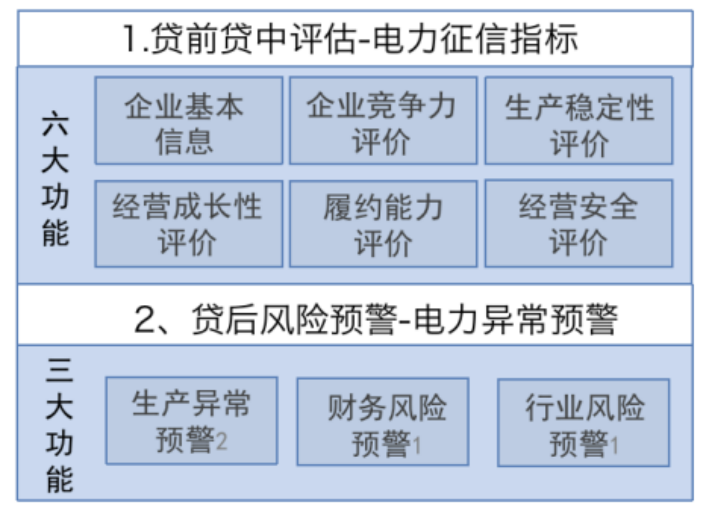
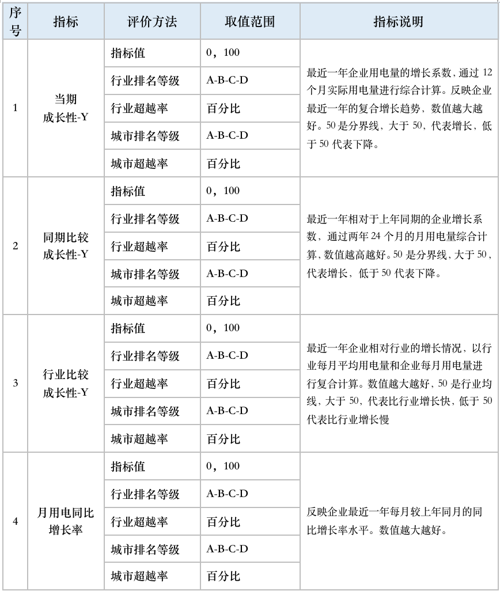
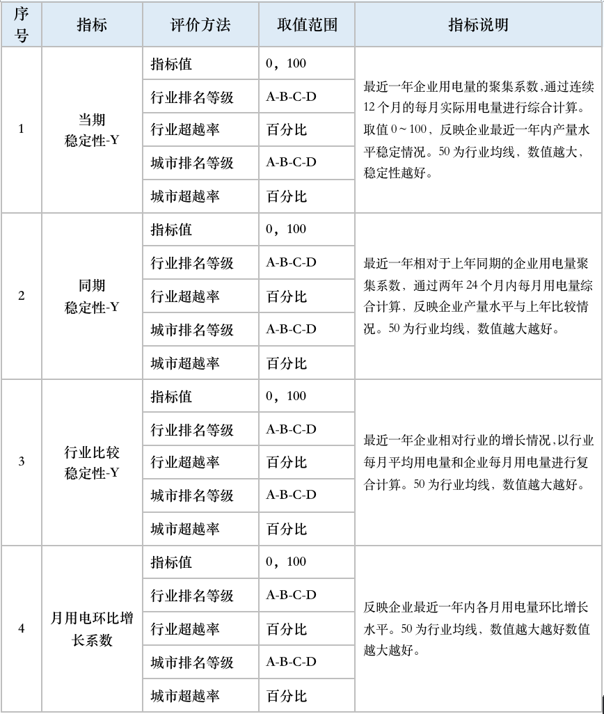
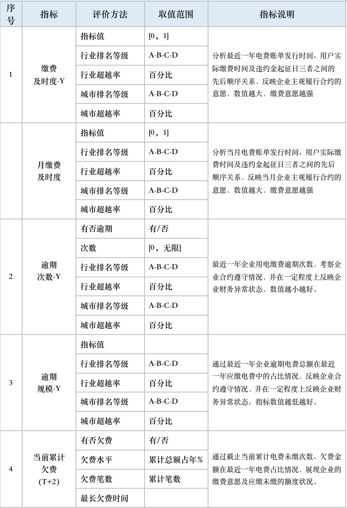
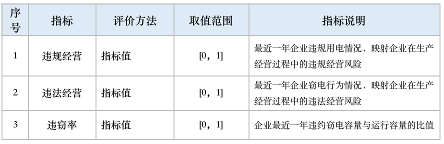
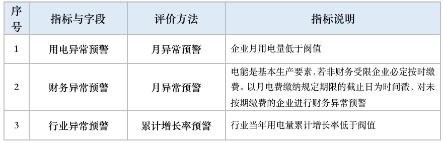

# 产品应用及数据说明

## 电眼查产品概要

### 产品综述

- 电力大数据真实记录企业生产的运行状态。自克强指数提出以来，利用电力大数据可信度高、时效性强、连续性好、完整性好、覆盖面广等特点，作为衡量企业、行业、经济运行好坏的可靠依据，已成为政经普遍共识。
- 本产品为纯电力数据应用，以企业、行业两个视角，对企业经营健康、业绩成长、竞争能力、履约风险等进行评估，并可对用电异常、缴费异常企业进行监控。
- 本产品中企业身份信息，来源于信息主体在办理用电业务时所提供的相关材料。
- 本产品1.0版数据源为广东省（不含深圳）31类制造业企业电力数据，数据周期为最近24个月，生产频率为“月”。所查询的数据为截止当前月的加工汇总数据，不保证全面和绝对精准的企业经营评价，但承诺在纯电力数据信息集合、汇总、计算、展示的全过程保持客观、中立地位。
- 查询机构在进行查询与下载时，需保证已获得信息主体企业的数据查询授权，并保证承担所提取数据的安全责任与义务。

### 产品数据范围

1. 行业范围：按国家分类标准31类制造业
2. 区域范围：广东省（深圳市除外）
3. 数据范围：企业用电行为、缴费行为、违窃行为等纯电力数据
4. 数据颗粒度：精确至日
5. 统计周期：24个月
6. 生产频率：按月更新
7. 数据安全：符合国家《数据安全法》、《征信管理条例》及南方电网公司标准
8. 保密提醒：本指标体系未经同意，请勿转述任何第三方

### 产品序列

## 指标的计算与评价方法

本1.0产品，对广东（深圳除外）制造业企业的历史与实时数据统一归集，采用国际通行AHP法、企业经营评估理论和金融风控要素逻辑，利用因子分析、聚类分析、正态分布、权重分析等进行计算并脱敏。

- 指标排名

  分“行业排名”与“城市排名”

          行业排名：指企业在广东省（深圳除外）的本行业排名。
    
          城市排名：指企业在所属城市的本行业排名。

- 排名等级
  按2:3:3:2的橄榄型比例分布规则，将指标分值的行业区域排名划分为A-B-C-D四个等级。具体等级范围如下：
		 
          A级：企业指标值排名在顶部20%范围
		
          B级：企业指标值排名在20%-50%之间
		
          C级：企业指标值排名在50%-80%之间
		
          D级：企业指标值排名在80%以下

- 超越率
  
  分“行业超越率”与“城市超越率”，是对排名等级的更精确补充
		
          行业超越率：指企业在本省同行业排名超越的企业比例
		
          城市超越率：指企业在本城市同行业排名超越的企业比例

## 指标说明

企业经营成长性衡量企业经营规模、营收能力扩大与收缩状况，反映企业综合经营要素和经营业绩的成长价值与发展能力。本评估通过24个月的企业、行业用电增长分析，综合考虑环境与周期影响，以当期成长性、同期比较成长性、行业比较成长性三个指标，对企业最近一年自身成长性、相对上年同期成长性、企业与行业一致性进行计算评价，分值越高成长性越高。指标值可作为企业财报数据不全和真实性的补充；并可通过最近一年的月同比增长，考察企业的周期情况。

### 企业基本信息

| 1 | 企业名称 |  |
| --- | --- | --- |
| 2 | 户表编码 | 企业名称对应的户表（可能多个） |
| 3 | 行业类别 | 企业登记的行业类别 |
| 4 | 所属城市 | 企业登记的用电地址 |
| 5 | 用电容量 | 供电合同确定的运行容量 |
| 6 | 立户日期 | 企业开户申请后的送电日期 |

### 企业竞争力评估

规模能力是衡量企业参与行业竞争和抵御风险的重要能力之一，是企业经营评估的重要维度。由于制造业企业用电量与产量、产值、利润率成正相关关系，本评估选取最近一年的企业运行容量、实际用电量和行业总运行容量、行业实际总用电量数据，以产能水平、产量水平两个指标对企业最大生产能力、企业实际产量水平进行计算和排名。并可通过最近一年连续12个月的月产量水平，考察企业的周期情况。

### 企业生产稳定性评估

生产稳定性水平是企业收益和付款能力稳定程度的基础保障，是衡量企业经营健康的重要维度。本评估通过最近24个月企业、行业用电波动分析，以当期稳定性、同期稳定性、行业比较稳定性三个指标，对企业最近一年自身稳定性、企业与去年同期差值稳定性、企业与行业一致性进行计算评价，分值越高稳定性越好。指标计算充分考虑了环境影响及行业周期的波动情况，指标值可作为企业财报数据不全和真实性的补充。并可通过最近一年的月用电环比波动，考察企业的周期情况。

### 企业经营成长性评估

企业经营成长性衡量企业经营规模、营收能力扩大与收缩状况，反映企业综合经营要素和经营业绩的成长价值与发展能力。本评估通过24个月的企业、行业用电增长分析，综合考虑环境与周期影响，以当期成长性、同期比较成长性、行业比较成长性三个指标，对企业最近一年自身成长性、相对上年同期成长性、企业与行业一致性进行计算评价，分值越高成长性越高。指标值可作为企业财报数据不全和真实性的补充；并可通过最近一年的月同比增长，考察企业的周期情况。

### 企业履约能力评估

电力应用是制造企业经营的基本生产要素，企业是否按时缴纳电费代表企业履行合同的支付能力和诚信水平。本评估通过截止当前的企业电费缴纳数据计算，以缴费及时度、逾期情况、欠费水平三个指标，对企业缴费意愿和缴纳情况进行评估。

### 企业经营安全性评估

依法、合规用电，是企业诚信的重要反映和健康经营的重要保障。本评估依照《电力供应与使用条例》规定，以企业最近一年是否发生违规用电行为（企业擅自改变用电类别、擅自迁移用电计量装置、擅自引入供电电源等六种）、违法用电行为（主要指窃电行为），对企业经营安全进行风险提示。

## 贷后异常预警指标明细

缺乏即时预警手段，难以及时发现贷款企业经营异常，一直是贷后监控难点。现在，每天采集数据的智能电表就是动态监控器。在获得目标企业客户充分授权前提下，本产品通过用电行为和缴费行为的实时监控进行异常预警，并根据行业用电增长情况进行行业异常预警。

